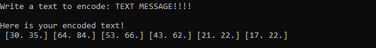

## About the program

 This program enables you to encode and decode text messages using matrices. Given a message and a square matrix, the program will generate a set of vectors with the encoded message, that you'll use to decode the message.

## How does it work?

### i - encode

 The program generates the vectors with the encoded message by assigning each letter in it in form of a number that enumerates it. Then, multiplying the matrix given by each vector, it will encode the message in the form of encoded vectors.

### ii - decode

 To decode the message, the program will simply multiply the inverse of the matrix given by each vector, generating the original vectors and assigning them back to each letter.

> *For more information, see: https://math.libretexts.org/Bookshelves/Applied_Mathematics/Applied_Finite_Mathematics_(Sekhon_and_Bloom)/02%3A_Matrices/2.05%3A_Application_of_Matrices_in_Cryptography#:~:text=To%20decode%20the%20message%2C%20we,we%20obtain%20the%20original%20message.*

## How to use

### to encode: 

 Input the values of the matrix

 

 Writte the text to encode

 *(the program will ignore punctuation, it'll only account for spaces and letters)*

 

 The program will give you the vectors with the encoded message

### to decode:

 Input the values of the matrix

 

 Input the vectors with the encoded message

  

 The program will give you the text message decoded